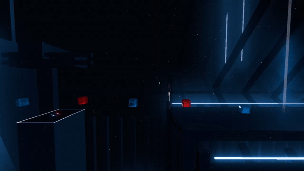
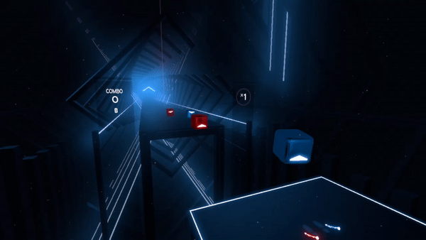
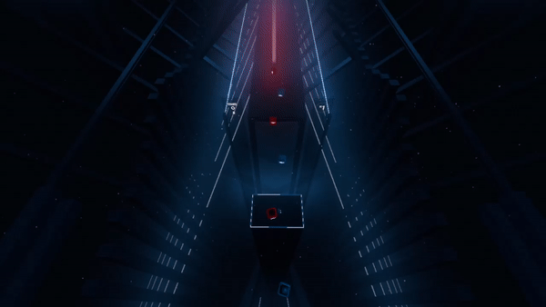
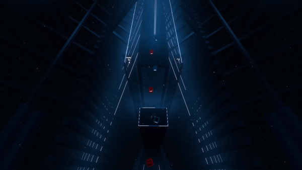
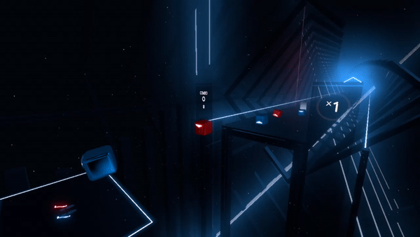

# Properties

These are all the properties than an object can be animated by.

## Noodle Extensions

### offsetPosition

`offsetPosition` may be used in both `AnimateTrack` and `AssignPathAnimation`

Describes the position **offset** of an object. It will continue any normal movement and have this stacked on top of it.

Multiple of this property will be added together.

!!! info
    One unit in `offsetPosition` is equal to the width of one lane (0.6 meters).

Point definition: `[x, y, z, time, (optional) easing, (optional) spline]`

??? example
    === "AnimateTrack"
        ``` { .json .copy }
        "examplePositionPointDef": [
          [0, 0, 0, 0],
          [0, 5, 0, 0.5, "splineCatmullRom"],
          [0, 0, 0, 1, "splineCatmullRom"]
        ]
        ```
        ``` { .json .copy }
        {
          "b": 4,
          "t": "AnimateTrack",
          "d": {
            "track": "firstPositionDemo",
            "duration": 8,
            "offsetPosition": "examplePositionPointDef"
          }
        }
        ```
        

    === "AssignPathAnimation"
        ``` { .json .copy }
        "examplePositionPath": [
          [0, 0, 0, 0],
          [0, 5, 0, 0.25, "splineCatmullRom"],
          [0, 0, 0, 0.5, "splineCatmullRom"]
        ]
        ```
        ``` { .json .copy }
        {
          "b": 12,
          "t": "AssignPathAnimation",
          "d": {
            "track": "firstPositionDemo",
            "duration": 4,
            "easing": "easeInBounce",
            "offsetPosition": "examplePositionPath"
          }
        }, {
          "b": 16,
          "t": "AssignPathAnimation",
          "d": {
            "track": "firstPositionDemo",
            "duration": 4,
            "easing": "easeOutBounce"
            "offsetPosition": [
              [0, 0, 0, 0]
            ]
          }
        }
        ```
        

### localRotation

`localRotation` may be used in both `AnimateTrack` and `AssignPathAnimation`

This property describes the **local** rotation offset of an object. This means it is rotated with itself as the origin. Uses euler values. Do note that the note spawn effect will be rotated accordlingly.

!!! warning
    Rotations are internally calculated **quaternions** to prevent gimbal lock. Rather than representing a set of rotations like euler, quaternions represent an orientation. In other words, `#!json [[0, 0, 0, 0], [360, 360, 360, 1]]` will have no movement at all, as both points are identical internally.

!!! tip
    Notes attempting to look towards the player may look strange, you can disable their look with [`disableNoteLook`](../items/objects.md#notes).

Multiple of this property will be added together.

Point definition: `[pitch, yaw, roll, time, (optional) easing, (optional) spline]`

??? example
    === "AnimateTrack"
        ``` { .json .copy }
        "localSpinDemoAnimate": [
          [0, 0, 0, 0],
          [90, 0, 0, 0.25],
          [180, 0, 0, 0.5],
          [270, 0, 0, 0.75],
          [360, 0, 0, 1]
        ],
        "localSpinDemoAnimateRev": [
          [0, 0, 0, 0],
          [-90, 0, 0, 0.25],
          [-180, 0, 0, 0.5],
          [-270, 0, 0, 0.75],
          [-360, 0, 0, 1]
        ]
        ```
        ``` { .json .copy }
        {
          "b": 20,
          "t": "AnimateTrack",
          "d": {
            "track": "localRotationDemo",
            "duration": 5,
            "easing": "easeInOutExpo",
            "localRotation": "localSpinDemoAnimate"
          }
        }, {
          "b": 25,
          "t": "AnimateTrack",
          "d": {
            "track": "localRotationDemo",
            "duration": 5,
            "easing": "easeInOutExpo",
            "localRotation": "localSpinDemoAnimateRev"
          }
        }
        ```
        

    === "AssignPathAnimation"
        ``` { .json .copy }
        "localSpinDemoPath": [
          [0, 0, 0, 0],
          [0, 0, 90, 0.125],
          [0, 0, 180, 0.25],
          [0, 0, 270, 0.375],
          [0, 0, 360, 0.5]
        ]
        ```
        ``` { .json .copy }
        {
          "b": 30,
          "t": "AssignPathAnimation",
          "d": {
            "track": "localRotationDemo",
            "localRotation": "localSpinDemoPath"
          }
        }
        ```
        

### offsetWorldRotation

`offsetWorldRotation` may be used in both `AnimateTrack` and `AssignPathAnimation`

This property describes the **world** rotation offset of an object. This means it is rotated with *the world* as the origin. Uses euler values. Think of the 360 characteristic.

!!! warning
    Rotations are internally calculated **quaternions** to prevent gimbal lock. Rather than representing a set of rotations like euler, quaternions represent an orientation. In other words, `#!json [[0, 0, 0, 0], [360, 360, 360, 1]]` will have no movement at all, as both points are identical internally.

Multiple of this property will be added together.

Point definition: `[pitch, yaw, roll, time, (optional) easing]`

??? example
    === "AnimateTrack"
        ``` { .json .copy }
        "RotationPointsAnimate": [
          [0, 0, 0, 0],
          [0, 90, 0, 0.25],
          [0, 180, 0, 0.5],
          [0, 270, 0, 0.75],
          [0, 360, 0, 1]
        ]
        ```
        ``` { .json .copy }
        // AnimateTrack
        {
          "b": 40,
          "t": "AnimateTrack",
          "d":{
            "track": "RotationDemo",
            "duration": 10,
            "offsetWorldRotation": "RotationPointsAnimate"
          }
        }
        ```
        

    === "AssignPathAnimation"
        ``` { .json .copy }
        "RotationPointsPath": [
          [0, 0, 0, 0],
          [0, 45, 0, 0.125, "splineCatmullRom"],
          [0, -45, 0, 0.25, "splineCatmullRom"],
          [0, 22.5, 0, 0.375, "splineCatmullRom"],
          [0, -22.5, 0, 0.5, "splineCatmullRom"],
          [0, 0, 0, 0.625, "splineCatmullRom"]
        ]
        ```
        ``` { .json .copy }
        {
          "b": 50,
          "t": "AssignPathAnimation",
          "d": {
            "track": "RotationDemo",
            "duration": 5,
            "offsetWorldRotation": "RotationPointsPath"
          }
        }, {
          "b": 55,
          "t": "AssignPathAnimation",
          "d": {
            "track": "RotationDemo",
            "duration": 5,
            "offsetWorldRotation":[
              [0, 0, 0, 0]
            ]
          }
        }
        ```
        

### scale

`scale` may be used in both `AnimateTrack` and `AssignPathAnimation`

Decribes the scale of an object. This will be based off their initial size. A scale of 1 is equal to normal size, anything under is smaller, over is larger.

Multiple of this property will be multiplied together.

Point definition: `[x, y, z, time, (optional) easing, (optional) spline]`
??? example
    === "AnimateTrack"
        ``` { .json .copy }
        "AnimateTrackScale": [
          [1, 1, 1, 0],
          [0.80, 0.80, 0.80, 0.15, "easeOutCirc"],
          [2, 2, 2, 0.5, "easeOutBounce"],
          [2, 2, 2, 0.6],
          [2.5, 1, 1, 0.8, "easeOutExpo"],
          [1, 1, 1, 1, "easeOutBounce"]
        ]
        ```
        ``` { .json .copy }
        {
          "b": 165,
          "t": "AnimateTrack",
          "d": {
            "track": "scaleTrack",
            "scale": "AnimateTrackScale",
            "duration": 5
          }
        }
        ```
        

    === "AssignPathAnimation"
        ``` { .json .copy }
        "PathScale": [
          [1, 1, 1, 0],
          [4, 0.5, 1, 0.20, "easeInElastic"],
          [1, 1, 1, 0.50, "easeOutElastic"]
        ]
        ```
        ``` { .json .copy }
        {
          "b":175,
          "t":"AssignPathAnimation",
          "d":{
            "track":"scaleTrack",
            "scale":"PathScale"
          }
        }
        ```
        

### dissolve

`dissolve` may be used in both `AnimateTrack` and `AssignPathAnimation`

This property controls the dissolve effect on both notes and walls. It's the same effect that happens when things go away upon failing a song. **Keep in mind that note bodies and the note arrows have seperate dissolve properties**, see [`dissolveArrow`](#dissolvearrow)

!!! note
    How this effect looks will depend on the player's "Bloom Post Process" effect. Lower graphics settings may instead see the note scaling up from 0, rather than the cutout effect.

`0` is fully transparent and `1` is fully opaque.

Multiple of this property will be multiplied together.

Point definition: `[transparency, time, (optional) easing]`

!!! tip
    It is possible to "disable" the jump animation when objects cannot be animated.

    ``` { .json .copy }
    // This note will be invisible during the jump animation.
    // Remember that if you want the note to be invisible for longer,
    // you should use Chroma's spawnEffect to hide the spawn effect.
    {
      "b": 60,
      "x": 1,
      "y": 0,
      "c": 0,
      "d": 1,
      "customData": {
        "spawnEffect": false,
        "animation": {
          "dissolve": [
            [0, 0],
            [1, 0],
          ]
        }
      }
    }
    ```

??? example
    === "AnimateTrack"
        ``` { .json .copy }
        // Point Definition
        "dissolveDemoAnimate": [
          [1, 0],
          [0, 0.25],
          [0.5, 0.50],
          [0, 0.75],
          [1, 1]
        ]
        ```
        ``` { .json .copy }
        // AnimateTrack
        {
          "b": 60,
          "t": "AnimateTrack",
          "d": {
            "track": "dissolveDemo",
            "duration": 10,
            "dissolve": "dissolveDemoAnimate"
          }
        }
        ```
        

    === "AssignPathAnimation"
        ``` { .json .copy }
        "dissolveDemoPath": [
          [0, 0],
          [1, 0.125],
          [1, 0.30],
          [0, 0.35]
        ]
        ```
        ``` { .json .copy }
        // AssignPathAnimation
        {
          "b": 70,
          "t": "AssignPathAnimation",
          "d": {
            "track": "dissolveDemo",
            "dissolve": "dissolveDemoPath"
          }
        }
        ```
        

### dissolveArrow

`dissolveArrow` may be used in both `AnimateTrack` and `AssignPathAnimation`

This property controls the dissolve effect on the arrows of notes. Similar to the look of the disappearing notes modifier. This property only affects notes.

Multiple of this property will be multiplied together.

Point definition: `[transparency, time, (optional) easing]`

??? example
    === "AnimateTrack"
        ``` { .json .copy }
        "dissolveArrowDemoAnimate": [
          [1, 0],
          [0, 1]
        ]
        ```
        ``` { .json .copy }
        {
          "b": 80,
          "t": "AnimateTrack",
          "d": {
            "track": "dissolveArrowDemo",
            "duration": 5,
            "dissolveArrow": "dissolveArrowDemoAnimate"
          }
        }, {
          "b": 85,
          "t": "AnimateTrack",
          "d": {
            "track": "dissolveArrowDemo",
            "duration": 5,
            "dissolveArrow": [
              [0, 0],
              [1, 1]
            ]
          }
        }
        ```
        

    === "AssignPathAnimation"
        ``` { .json .copy }
        "dissolveArrowDemoPath": [
          [0, 0.10],
          [1, 0.20],
          [1, 0.30],
          [0, 0.35]
        ]
        ```
        ``` { .json .copy }
        {
          "b": 90,
          "t": "AssignPathAnimation",
          "d": {
            "track": "dissolveArrowDemo",
            "dissolveArrow": "dissolveArrowDemoPath"
          }
        }
        ```
        

### interactable

`interactable` may be used in both `AnimateTrack` and `AssignPathAnimation`

This property controls whether or not the player can interact with the note/wall.

`interactable` either is or isn't, there is no in-between. When great than or equal to `1`, the object can fully be interacted with. When less than `1`, the object cannot be interacted with at all.

Multiple of this property will be multiplied together.

Point definition: `[interactable, time, (optional) easing]`

??? example
    This is where I would put my example, IF I HAD ANY!

### definitePosition

`definitePosition` may only be used in `AssignPathAnimation`

Describes the **definite** position of an object. Will completely overwrite the object's default movement. However, this does still take into account x/y and world rotation.

An object with with `definitePosition` will still be offset by the `offsetPosition` property.

!!! note
    One unit in `definitePosition` is equal to the width of one lane (0.6 meters).

Point definition: `[x, y, z, time, (optional) easing, (optional) spline]`

??? example
    ``` { .json .copy }
    "defPosPath":[
      [0, 0, 20, 0],
      [10, 0, 20, 0.1],
      [10, 10, 20, 0.2],
      [0, 10, 20, 0.3],
      [0, 0, 20, 0.4],
      [0, 0, 10, 0.5],
      [-20, 0, 10, 1.0]
    ],
    "defPosNormal":[
      [0,0,23,0],
      [0,0,0,0.5],
      [0,0,-23,1]
    ]
    ```
    ``` { .json .copy }
    {
      "b":0,
      "t":"AssignPathAnimation",
      "d":{
        "track":"definitePosDemo",
        "definitePosition":"defPosNormal",
        "duration":0
      }
    }, {
      "b":132,
      "t":"AssignPathAnimation",
      "d":{
        "track":"definitePosDemo",
        "definitePosition":"defPosPath",
        "duration":3
      }
    }
    ```
    

### time

`time` may only be used in `AnimateTrack`

`time` is relatively advanced so make sure to have a solid understanding of Noodle Extensions before delving into time. `time` can only be used in AnimateTrack as it lets you control what point in the note's "lifespan" it is at a given time.

``` { .json .copy }
[
  [0, 0],
  [0.2, 0.2],
  [0.3, 0.4],
  [0.4, 0.4]
]
```

It is worth noting that every object on one track will get the same time values when animating this property. This means they would suddenly appear to all be at the same point. **It is recommended for every object to have its own track when using `_time`**

Say you want a time AnimateTrack on an object that will make it behave normally for starters. You want the AnimateTrack to start *right when the object spawns*, meaning `_time-halfJumpDurationInBeats` of the object. It's duration should be `halfJumpJurationInBeats*2`. With this, the point definition of

``` { .json .copy }
[
  [0, 0],
  [1, 1]
]
```

would behave as normal.

``` { .json .copy }
[
  [0, 0],
  [0.45, 0.15],
  [0.15, 0.30],
  [0.5, 0.5],
  [1, 1]
]
```

would appear to go forwards, then backwards.

!!! note
    If you intend to despawn an object using `time`, obstacles will despawn at a time that is >1 while notes will despawn at a time that is >=1.

!!! warning
    It is recommended to make sure that real notes still reach the play at their beat time, as this is when the note cut sound effect is timed to play.

Multiple of this property will only use the first instance.

Point definition: `[time, time, (optional) easing]`

??? example
    It is highly recommended you script/automate anything involving time. This is simply showcasing on one note to help visualize.
    ``` { .json .copy }
    "SingleNoteTime": [
      [0, 0],
      [0.45, 0.15],
      [0.15, 0.30],
      [0.5, 0.5],
      [1, 1]
    ]
    ```
    ``` { .json .copy }
    {
      "b": 153,
      "t": "AnimateTrack",
      "d": {
        "time": "SingleNoteTime",
        "duration": 10,
        "track": "singleNoteTimeTrack"
      }
    }
    ```
    

## Chroma

### color

`color` may be used in both `AnimateTrack` and `AssignPathAnimation`

Describes the color of an object. Will override any other color the object may have had.

Color is on a scale from 0 - 1, and NOT 0 - 255.

Multiple of this property will be multiplied together.

Point definition: `[red, green, blue, alpha, time, (optional) easing]`

??? example
    === "AnimateTrack"
        ``` { .json .copy }
        "RightColorWallAnimate": [
          [1, 0, 0, 1, 0.2],
          [0, 1, 0, 1, 0.4],
          [0, 0, 1, 1, 0.6],
          [0, 1, 1, 1, 0.8],
          [1, 1, 1, 1, 1]
        ],
        "LeftColorWallAnimate": [
          [1, 0, 0, 0, 0.2],
          [0, 1, 0, 0, 0.4],
          [0, 0, 1, 0, 0.6],
          [0, 1, 1, 0, 0.8],
          [1, 1, 1, 0, 1]
        ]
        ```
        ``` { .json .copy }
        {
          "b": 98,
          "t": "AnimateTrack",
          "d": {
            "track": "RightColorWall",
            "color": "RightColorWallAnimate",
            "duration": 10
          }
        }, {
          "b": 98,
          "t": "AnimateTrack",
          "d": {
            "track": "LeftColorWall",
            "color": "LeftColorWallAnimate",
            "duration": 10
          }
        }
        ```
        

    === "AssignPathAnimation"
        ``` { .json .copy }
        "GradientPathOne": [
          [1, 0, 0, 0.5, 0.0416],
          [0, 1, 0, 0.5, 0.0832],
          [0, 0, 1, 0.5, 0.1248],
          [1, 0, 0, 0.5, 0.1664],
          [0, 1, 0, 0.5, 0.208],
          [0, 0, 1, 0.5, 0.2496],
          [1, 0, 0, 0.5, 0.2912],
          [0, 1, 0, 0.5, 0.3328],
          [0, 0, 1, 0.5, 0.3743],
          [1, 0, 0, 0.5, 0.416],
          [0, 1, 0, 0.5, 0.4576],
          [0, 0, 1, 0.5, 0.4992]
        ],
        "GradientPathTwo": [
          [0, 1, 0, 0.5, 0.0416],
          [0, 0, 1, 0.5, 0.0832],
          [1, 0, 0, 0.5, 0.1248],
          [0, 1, 0, 0.5, 0.1664],
          [0, 0, 1, 0.5, 0.208],
          [1, 0, 0, 0.5, 0.2496],
          [0, 1, 0, 0.5, 0.2912],
          [0, 0, 1, 0.5, 0.3328],
          [1, 0, 0, 0.5, 0.3743],
          [0, 1, 0, 0.5, 0.416],
          [0, 0, 1, 0.5, 0.4576],
          [1, 0, 0, 0.5, 0.4992]
        ]
        ```
        ``` { .json .copy }
        {
          "b": 110,
          "t": "AssignPathAnimation",
          "d": {
            "track": "RightColorWallStatic",
            "duration": 2,
            "color": "GradientPathOne"
          }
        }, {
          "b": 114,
          "t": "AssignPathAnimation",
          "d": {
            "track": "RightColorWallStatic",
            "duration": 6,
            "easing": "easeOutElastic",
            "color": "GradientPathTwo"
          }
        }, {
          "b": 110,
          "t": "AssignPathAnimation",
          "d": {
            "track": "LeftColorWallStatic",
            "duration": 2,
            "color": "GradientPathTwo"
          }
        }, {
          "b": 114,
          "t": "AssignPathAnimation",
          "d": {
            "track": "LeftColorWallStatic",
            "duration": 6,
            "easing": "easeOutElastic",
            "color": "GradientPathOne"
          }
        }
        ```
        
